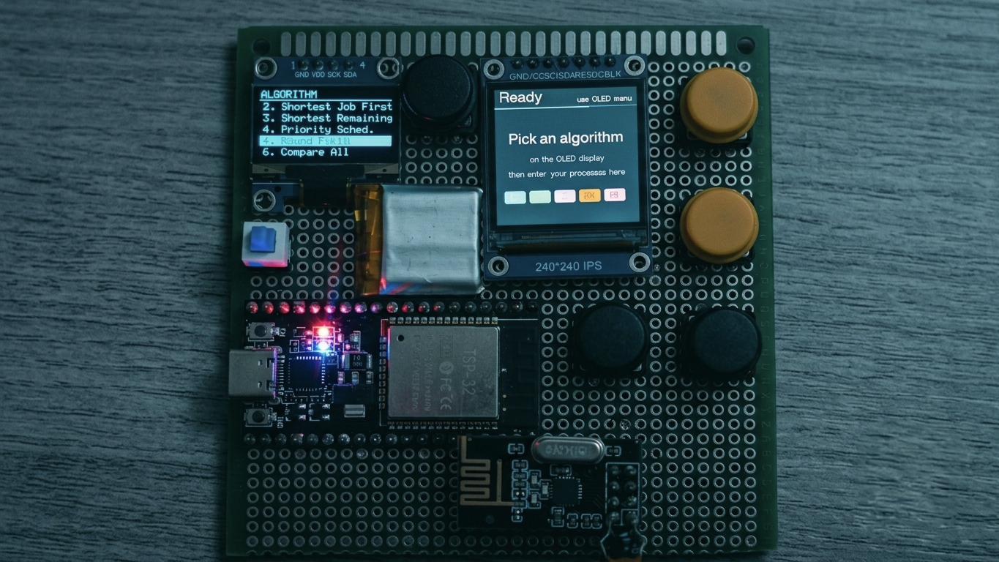
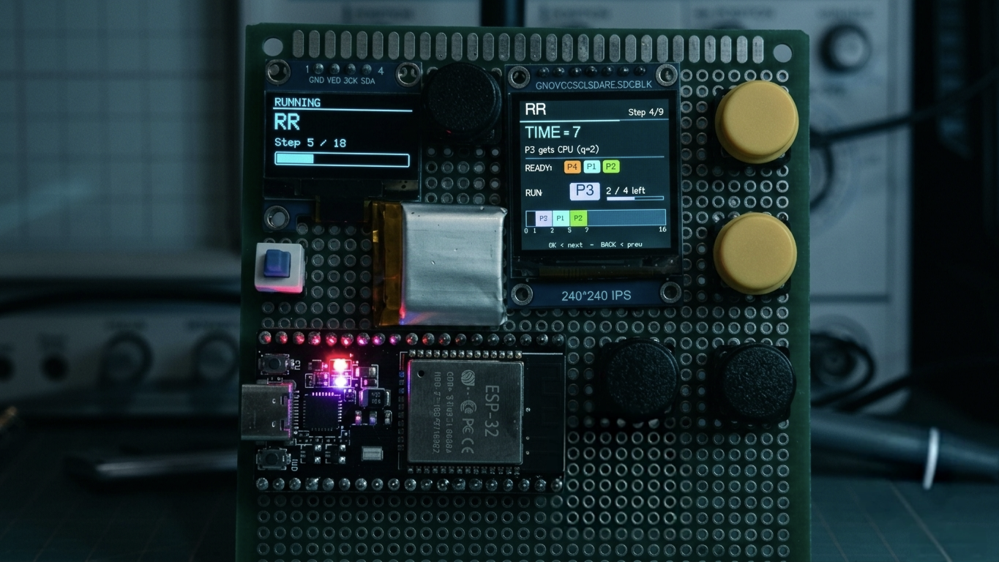
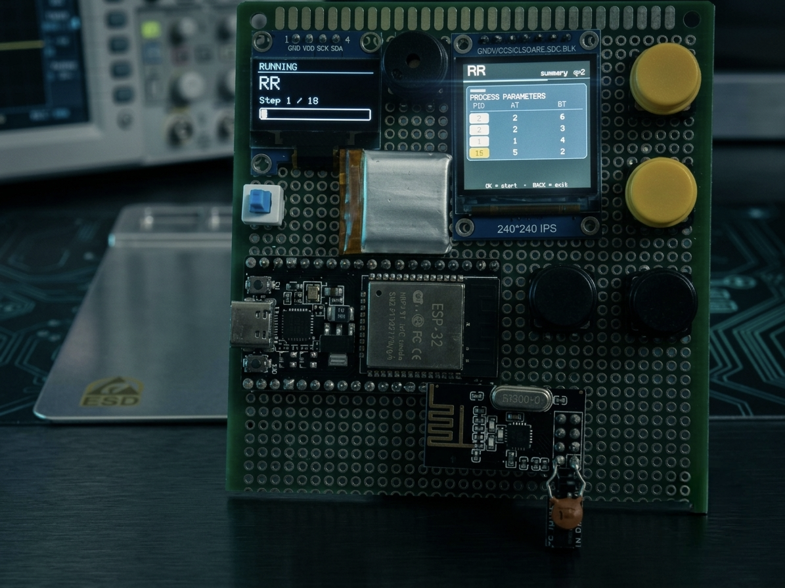
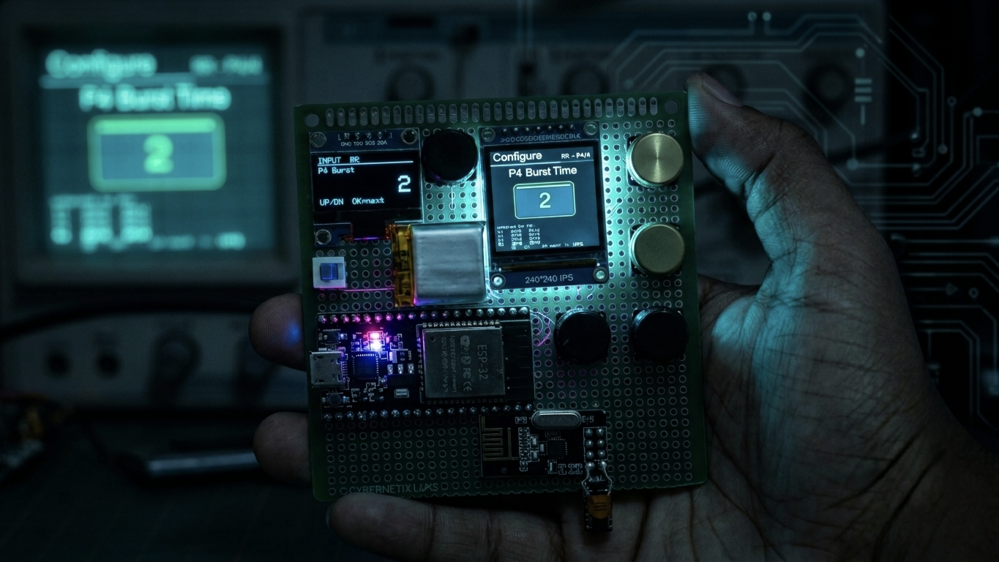
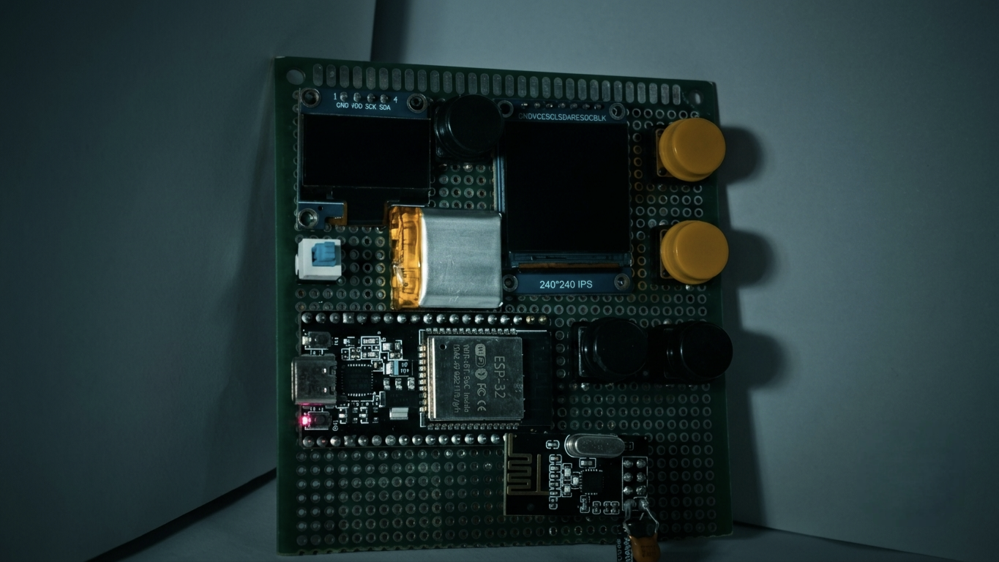
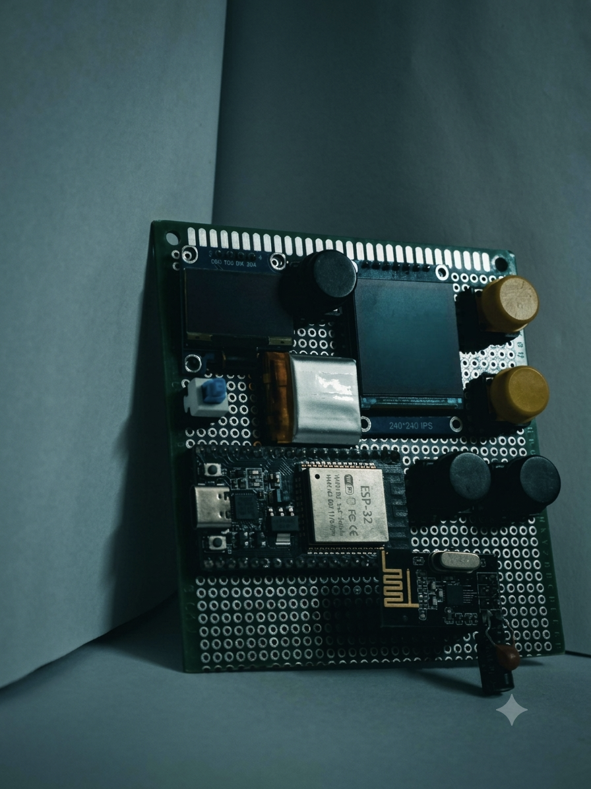
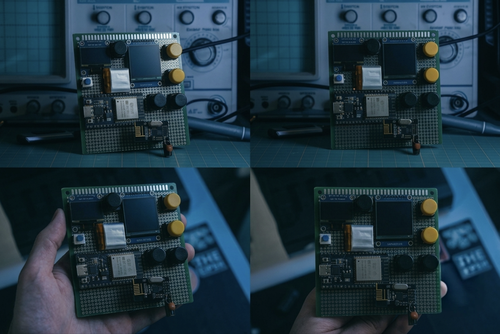
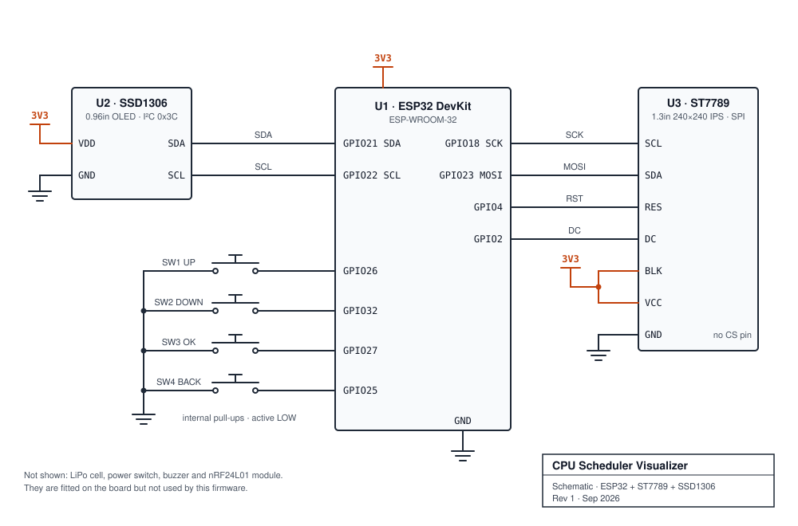
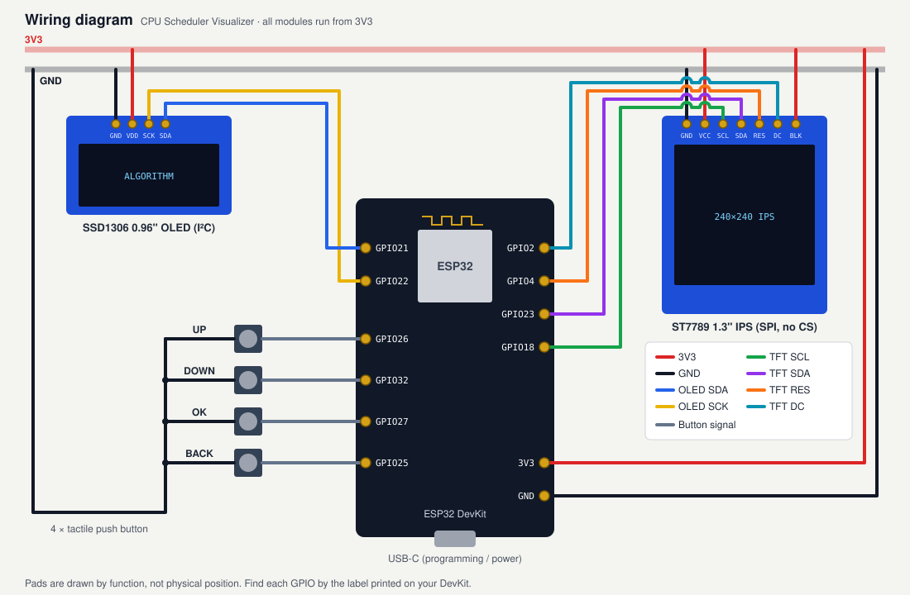

# CPU Scheduler Visualizer

A handheld ESP32 gadget that teaches CPU scheduling. Pick an algorithm on the OLED, enter your processes with four buttons, and the IPS screen steps through the schedule: the ready queue, the running process, a Gantt chart that builds as you go, and the final metrics.



## Features

- **Five algorithms**: FCFS, SJF (non-preemptive), SRTF (preemptive), Priority (non-preemptive) and Round Robin, plus a **Compare All** mode.
- **Step-by-step playback**: every scheduling decision is its own page, showing the current time, ready queue, running process with its remaining burst, and a mini Gantt chart up to that point.
- **Animated results**: full Gantt chart, per-process table (CT / TAT / WT / RT), average waiting, turnaround and response time, and CPU utilization.
- **Pros and cons** of each algorithm, shown on the device.
- **Side-by-side comparison**: bar charts of all five algorithms on the same input, with the best one highlighted in green. If every algorithm ties, none is highlighted.
- **Two screens**: the OLED shows the menu, input hints and a progress bar, and the 240×240 IPS shows the visualization.

## Gallery

| | |
|---|---|
|  |  |
| *Round Robin, step 4: P3 runs while P4, P1 and P2 wait* | *Input summary before a run starts* |
|  |  |
| *Entering P4's burst time* | *The board, powered off* |

<details>
<summary>More photos</summary>




</details>

## Hardware

### Bill of materials

| Qty | Part | Notes |
|---|---|---|
| 1 | ESP32 DevKit (ESP-WROOM-32) | Any board with the GPIOs below broken out |
| 1 | 1.3" ST7789 240×240 IPS, SPI | 7-pin version with no CS pin (GND VCC SCL SDA RES DC BLK) |
| 1 | 0.96" SSD1306 128×64 OLED, I²C | 4-pin, address `0x3C` |
| 4 | Tactile push buttons | UP, DOWN, OK, BACK |
| 1 | Perfboard + wire | |

The board in the photos also has a LiPo cell, a power switch, a buzzer and an nRF24L01 radio. This firmware doesn't use any of them, so they're left out of the diagrams.

### Pin map

| Module | Module pin | ESP32 |
|---|---|---|
| ST7789 IPS | SCL | GPIO18 (VSPI SCK) |
| | SDA | GPIO23 (VSPI MOSI) |
| | RES | GPIO4 |
| | DC | GPIO2 |
| | BLK | 3V3 |
| | VCC / GND | 3V3 / GND |
| SSD1306 OLED | SDA | GPIO21 |
| | SCK | GPIO22 |
| | VDD / GND | 3V3 / GND |
| Button UP | | GPIO26 → GND |
| Button DOWN | | GPIO32 → GND |
| Button OK | | GPIO27 → GND |
| Button BACK | | GPIO25 → GND |

The buttons use the ESP32's internal pull-ups and are active LOW, so each one just connects its GPIO to GND.

### Schematic



### Wiring diagram



## Software setup

1. Install the [Arduino IDE](https://www.arduino.cc/en/software) and the **esp32** board package by Espressif (Boards Manager).
2. Install these libraries from the Library Manager:
   - **TFT_eSPI** by Bodmer
   - **Adafruit SSD1306**
   - **Adafruit GFX Library**
3. **Configure TFT_eSPI.** The library reads its pin setup from a file inside the library folder. Copy [`firmware/TFT_eSPI_setup/User_Setup.h`](firmware/TFT_eSPI_setup/User_Setup.h) over `Arduino/libraries/TFT_eSPI/User_Setup.h`, and back up the original first. This sets the ST7789 driver, the pins, and **SPI mode 3**, which the CS-less module needs. Without it the screen stays blank.
4. Open `firmware/CPU_Scheduler/CPU_Scheduler.ino`, select your ESP32 board and port, and upload.

## Using it

| Button | Action |
|---|---|
| UP / DOWN | Move through the menu, change a value (hold to repeat) |
| OK | Select / next page |
| BACK | Previous field or page, or exit from the first page |

1. **Splash**: press OK.
2. **Menu (OLED)**: choose an algorithm or *Compare All*.
3. **Inputs (IPS)**: set the number of processes, then each process's values:

   | Field | Range | Asked for |
   |---|---|---|
   | Processes | 2 – 6 | always |
   | Arrival time | 0 – 30 | always |
   | Burst time | 1 – 20 | always |
   | Priority | 1 – 9 (lower = higher priority) | Priority, Compare All |
   | Time quantum | 1 – 9 | Round Robin, Compare All |

4. **Run**: press OK to go through the pages:
   input summary → one page per scheduling decision → Gantt chart → per-process table → metrics (2 pages) → advantages → disadvantages → comparison (2 pages).
   *Compare All* shows the input summary and then the two comparison pages. The OLED shows how far through the run you are.

The values start pre-filled with a sample set (P1–P4: AT 0/1/2/3, BT 6/2/8/4), so you can press OK straight through for a quick demo.

### Scheduling details

- Ties are broken by the lower process ID.
- SRTF runs one time unit at a time and preempts as soon as a shorter job arrives.
- In Round Robin, processes that arrive during a time slice join the queue before the preempted process goes back in.
- The screens label times as "ms", but they're abstract time units.
- Limits: 6 processes, 96 Gantt slices and 24 recorded steps per run.

## Repository layout

```
├── firmware/
│   ├── CPU_Scheduler/
│   │   └── CPU_Scheduler.ino      # the whole firmware (single file)
│   └── TFT_eSPI_setup/
│       └── User_Setup.h           # drop-in config for the TFT_eSPI library
├── hardware/
│   ├── schematic.svg
│   └── wiring-diagram.svg
└── docs/
    └── images/                    # build photos
```
